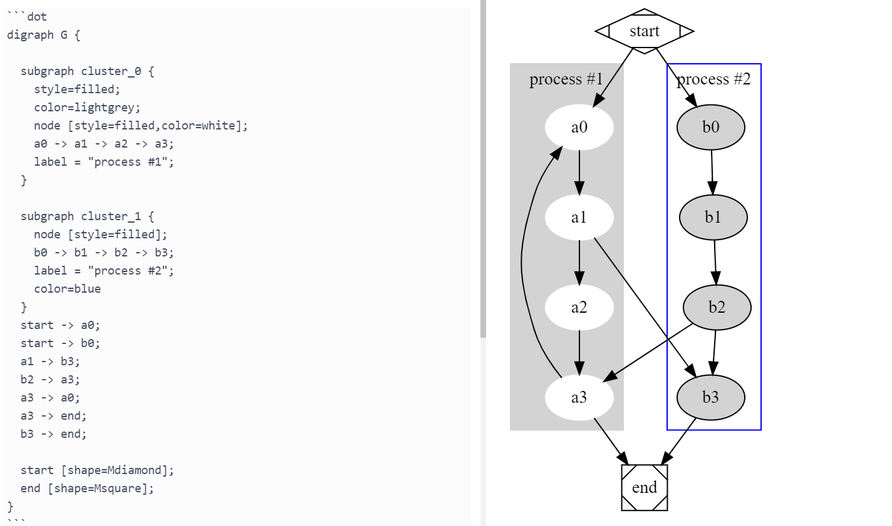

A rendering plugin for the dot language using [@viz-js/viz](https://www.npmjs.com/package/@viz-js/viz).
No need to install the Graphviz executable.

## Install
```
ipm install graphviz-standalone
```

## Usage
After installation, the following syntax written in the code block will be drawn by Graphviz when previewing.
 * circo
 * dot
 * fdp
 * neato
 * osage
 * twopi

## Screenshot


## What is Graphviz?
Graphviz is graph visualization software.
It converts graph structures described in text format into images.

For more detailed information, please see Graphviz official website.
https://graphviz.org/
