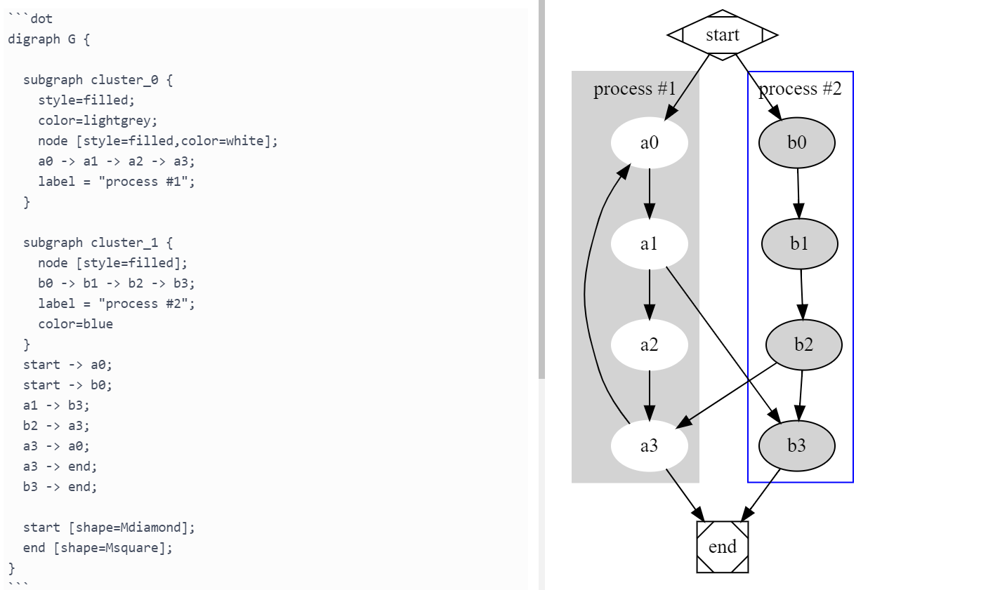

A rendering plugin for the "dot" language using [viz.js](https://www.npmjs.com/package/viz.js).
No need to install the Graphviz binary.

## Install
```
ipm install graphviz-standalone
```

## Screenshot

